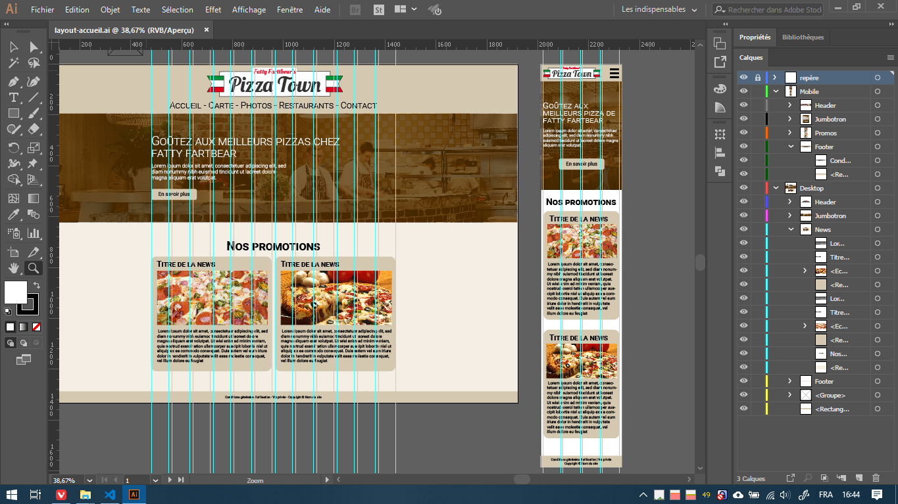

# Projet de construction d'un site de restaurant en Bootstrap <!-- omit in toc -->
Concevoir et intégrer un site de restaurant en utilisant Bootstrap

Projet solo par **Frédérick Van Isschot**

- [But du projet](#but-du-projet)
  - [Les pages:](#les-pages)
- [Les difficultés](#les-difficultés)
  - [La contrainte du temps](#la-contrainte-du-temps)
  - [Bootstrap](#bootstrap)
- [Les étapes de travail](#les-étapes-de-travail)
  - [Conception de la maquette](#conception-de-la-maquette)
  - [Codage](#codage)
    - [Le header](#le-header)
    - [Le jumbotron](#le-jumbotron)
    - [La carte](#la-carte)
    - [Les photos](#les-photos)
    - [Les restaurants](#les-restaurants)
- [Conclusion](#conclusion)

## But du projet
Le but est réaliser un site vitrine d'une franchise de restaurants sur le type de nourriture de notre choix.

Il devra comporter cinq pages: Accueil, Carte, Photos, Restaurants et Contact. Il devra également être responsive pour téléphone, tablette et ordinateurs.

### Les pages:
- Une page **Accueil** avec un composant Jumbotron et deux panneaux (panel) pour afficher des news (genre promotions, news ou évènements de la semaine)
- Une page **Carte** avec les menus présentés sous forme de liste groupée avec badges
- Une page **Photos** avec une galerie photo (minimum 10) et une pagination (3 photos par page)
- Une page **Restaurants** avec l'adresse, un plan d'accès et les heures d'ouverture d’au moins deux restaurants (c’est une franchise !)
- Une page **Contact** avec un formulaire de contact comprenant nom, prénom, e-mail, liste déroulante (objet du message avec un select et des options), un champ  de texte (pour le message), un bouton d'envoi avec [glyphicon](http://glyphicons.com/). Les intitulés des champs sont dans la balise sémantique adéquate. 

## Les difficultés
### La contrainte du temps
À la base, ce projet devait être réalisé en solo en moins de trois jours... ce qui est à la limite du possible!

D'autant plus que c'est un site qu'on doit le concevoir sois même: aucune maquette ni aucune ressource ne nous a été fournis, on doit l'imaginer sois même!

Moi qui ai suivi six mois de formation sur la conception d'un site, je peux vous dire que ça ne se fait pas en trois jours! Il faut au moins deux semaines le temps de pouvoir rassembler des idées, faire les wireframes et maquettes de chaque page de son site, trouver les images, les textes, et tout le bataclan! Alors, réaliser tout ça tout seul en moins de trois jours, c'est chaud!

Après les coachs nous ont finalement accordés jusqu'à la fin de la semaine, mais ça reste quand même un peu abusé comme timing...

### Bootstrap
Non seulement il y avait le timing serré, mais en plus il y a Bootstrap. Je déteste Bootstrap!

J'aurais préféré réaliser tout le site en faisant mes propres styles et limite avoir recours à du JavaScript, ça aurait été tellement plus vite que de devoir apprendre Bootstrap, il est tellement pénible à utiliser, restrictif sur certains points et certaines choses m'ont pris beaucoup plus de temps qu'il aurait dû (notamment le menu qui pose encore problème et qui m'a fait perdre une demi-heure pour le mettre en place).

## Les étapes de travail
J'ai dû appliquer tout ce que j'ai appris en UX Webdesign: concevoir des maquettes étape par étape: le wireframe puis la maquette et enfin intégrer en web.

Moi qui ai de grosses lacunes en créativité, c'est ce qui m'as pris le plus de temps, le temps que je trouve les idées et trouver comment je vais mettre en page.

### Conception de la maquette
Pour avoir une meilleure vision de comment je vais construire mon site il a fallu d'abord que je fasse une maquette, pour cela j'ai utilisé Adobe Illustrator.

Pour la première étape, j'ai fait d'abord un *wireframe*, ou je construis une maquette sans élément graphique (les images auront une crosse croix dessus)

Une fois le wireframe terminé, je cherche ou je crée les éléments graphiques qui seront sur mes pages: logos, images, pictogrammes, police, etc...

Une fois ces éléments rassemblés, depuis le wireframe que j'ai construit précédemment, je mets en place les éléments graphiques, les couleurs de mes blocs pour donner ce que va vraiment ressembler mon site en HTML



### Codage
En me basant sur la maquette que j'ai créée, je crée les différentes pages en utilisant les classes Bootstrap, l'utilisation des grilles m'a rendu la tâche un peu plus aisée, mais la plus grosse difficulté que j'ai eue est le menu sur le header.

---

#### Le header
C'était très compliqué à le mettre en place, non seulement Bootstrap demande d'utiliser une structure assez strict dans les balises et les classes HTML mais en plus ma page refusait de l'afficher correctement en responsive avec le menu burger.

J'ai finalement réussi à le placer correctement, mais il reste encore des bugs dans l'affichage que je ne saurais le corriger à cause que c'est Bootstrap qui le gère.

---

#### Le jumbotron
Le jumbotron de base est moche, j'ai utilisé ma vieille technique d'utiliser une `<section>` où je mettrai un fond qui occupera toute la largeur de la page et le conteneur à l'intérieur qui gèrera la largeur responsive.

---
#### La carte

C'est la seule page que je n'ai pas conçu de maquette, étant donné que l'exercice nous demande d'utiliser la liste groupée avec les badges de Bootstrap, je ne me suis pas pris la tête vu que ce sera Bootstrap qui gèrera la disposition. J'ai utilisé Fontawesome pour afficher les petites icônes de piments, ce qui est beaucoup plus pratique que d'utiliser des images.

---

#### Les photos
Pour les photos j'ai décidé de coder moi même en JavaScript pour gérer la pagination, c'était tout simple à mettre en place.

Je crée plusieurs divs qui seront les différentes pages de trois photos, je garde la première visible et je masque les trois autres.

Avant toute chose je crée une variable qui servira de repère au script pour savoir quel page est actuellement ouvert.

``` javascript
let curPage = 1 
```

Pour les boutons numérotés, j'ai tout simplement créé une fonction qui va échanger l'affichage des pages, la fonction contient un argument qui indiquera quel page afficher.

``` html
<button class="page-link" onclick="openPage(2)">
```

La fonction va d'abord masquer la page affichée actuellement...

``` javascript
function openPage(pageId) {
    document.getElementById("btn-page"+curPage).classList.remove("active")
    document.getElementById("page"+curPage).classList.replace("page-active","page")
    [...]
```

...et qui va ensuite afficher la page que j'ai demandé et attribuer la nouvelle page dans la variable `curpage`.

``` javascript
    [...]
    document.getElementById("btn-page"+pageId).classList.add("active")
    document.getElementById("page"+pageId).classList.replace("page","page-active")
    curPage = pageId;
}
```

Pour ce qui est des boutons fléchés, ce sera une autre fonction dont les boutons exécuteront une fonction avec comme argument d'aller à la page suivante ou la page précédente.

J'ai utilisé un `switch` qui sera plus facile de vérifier la condition de l'argument, il va ensuite se référer à une autre fonction `checkPage` et va ensuite ver ma fonction `openpage`

``` javascript
function nextPage(action) {
    switch (action) {
        case 0:
            page = curPage - 1
            break;
        case 1:
            page = curPage + 1
            break;
    }
    pageId = checkPage(page);
    openPage(pageId);
}
```


La fonction checkPage va juste faire en sorte que le numéro de la page à vérifier ne passe pas à 5 ou 0, il va le corriger de sorte à toujours afficher la bonne page et éviter des erreurs.

``` javascript
function checkPage(page){
    if(page > 4){
        return 1
    } else if(page < 1){
        return 4
    } else{
        return page
    }
}
```
#### Les restaurants
Pour les restaurants je me suis contenté d'une intégration Google Maps pour afficher une carte pour chaque restaurant.

## Conclusion
Pour moi personnellement, je n'utiliserai pas Bootstrap au quotidien, j'ai eu beaucoup de problèmes avec et je préfère tout faire au css, moi qui suis habitué avec.

Bootstrap est très restreint, très strict au niveau de la structure au niveau du HTML et ça devient trop compliqué à lire avec toutes les classes Bootstrap qui s'empilent et les divs à outrance. Je ne suis absolument pas fan de cette façon de travailler et j'aurais mis beaucoup moins de temps à mettre en place de manière traditionnel.